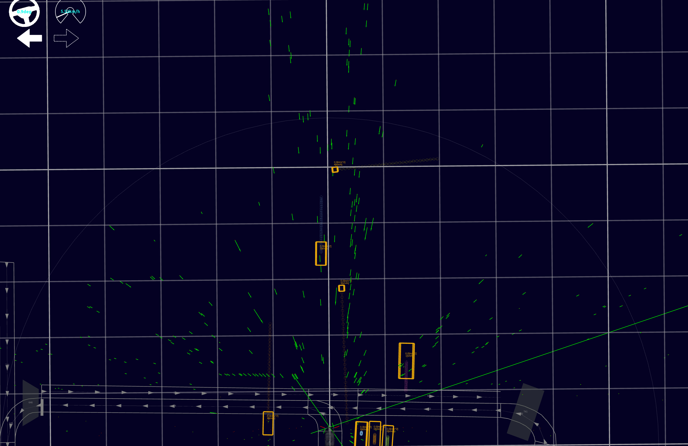

# view radar scan

Visualize radar scan message 



## How to use

```
#cd your_ws
cd src
git clone <this repo>

# build in ws
cd ../
colcon build --symlink-install --cmake-args -DCMAKE_BUILD_TYPE=Release --continue-on-error --parallel-workers 6 --packages-select view_radarscan
```

Just launch or run `show_radar_scan`.

```
ros2 launch view_radarscan.launch.xml
```