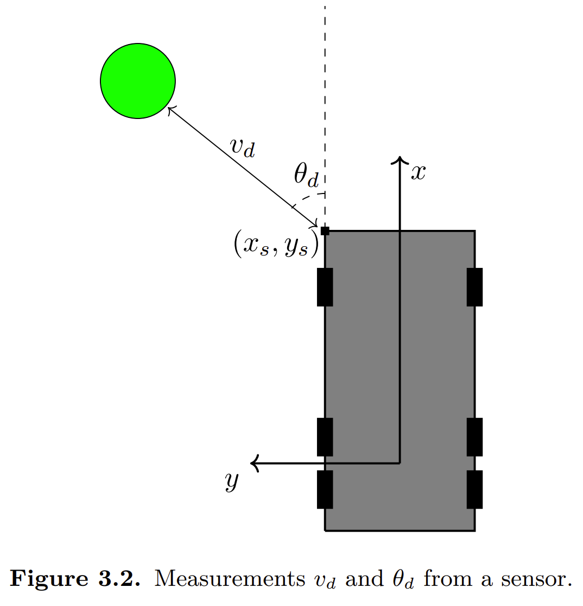

# Doppler velocity canceling

## Reference

https://kth.diva-portal.org/smash/get/diva2:1271521/FULLTEXT01.pdf

## Equation

Assume following coordinate system:

The velocity towards the target is given by the following equation:

$$
v_{d} = (v - \omega y_s) \cos \theta_d + \omega x_s \sin \theta_d
$$

where: $v, \omega$ are the velocity and angular velocity of the base_link, respectively, $x_s, y_s$ are the relative position of the sensor, and $\theta_d$ is the angle between the sensor and the target.